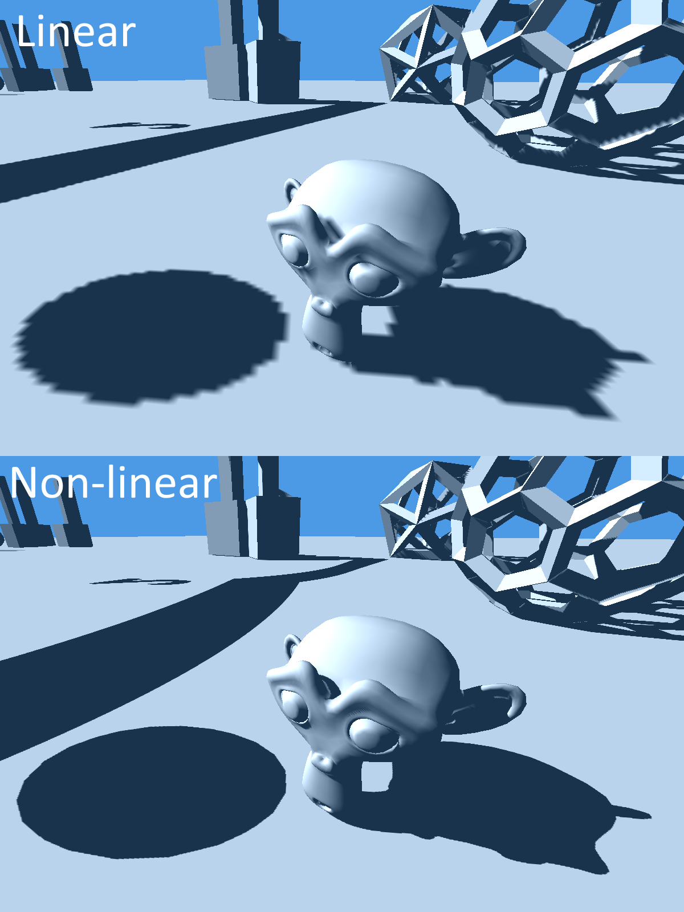

This is an alternative to cascaded shadow maps.

It allows for increased shadow resolution close to the camera while rendering the scene just once.

When rendering the scene to the shadow map each vertex is transformed by a function such that triangles closer to 0
cover larger area, resulting in larger amount of texels covered. Consequently triangles closer to the edge
cover smaller area.

The main issue with this technique is need for dense enough meshes to minimize shadow bending.
Also there is no way to avoid pixel jitter when camera moves
